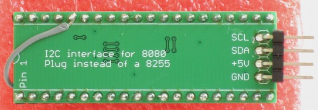
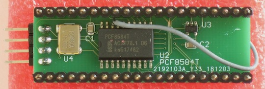

# I2C interface for i8080 (and simlilar) computers

(The wire fixes an error in an intial version of the board; in the Eagle and Gerber files available here the error has been fixed.)

## Introduction

This project is an I2C interface for i8080/i8085/Z80-based computers. The interface is bulit around NXP's PCF8584 I2C bus controller. The PCB is size- and pin-compatible with the i8255 Programmable Peripheral Interface and can be plugged into i8255's socket (of course it requires different code to setup and run). A code example is provided.

## Schematic

[Schematic](Eagle/Radio86RK-I2C-schematic.pdf)

The schematic follows the datasheet for the PCF8584. 

## PCB layout 

[PCB layout](Eagle/Radio86RK-I2C-pcb.pdf)

Note that all parts, with the possible exception of the 4-pin I2C header, are on the underside of the PCB.

## Bill of Materials

U1 (8255) in the schematic is just the DIL male socket, not the actual IC.

Depending on PCF8584 programming, the following oscillator (U4) frequencies can be used: 3, 4.43, 6, 8, 12MHz. With a different board, the clock can of course be shared with the CPU or other preriperals.

Name  | Part               | Value   | Package | Quantity
----- | ------------------ | ------- | ------- | --------
U2    | I2C-bus controller | PCF8584T | S020   | 1
U3    | Signle NAND gate | 741G00DBV | SOT23-5 | 1
U4    | Oscillator         | 12MHz   | 5x7mm   | 1
C1,C2 | Capacitor          | 0.1uF   | 0805    | 2
I2C   | 0.1" pin header    |         | 1x4     | 1

## Example code

Intel 8080 assembler - can be compiled with e.g. [asm8080](https://github.com/mac2rk/asm8080). The code assumes that the PCF8584 I/O ports are mapped to memory addresses 0A000h (data port) and 0A001h (control port). 

    ; PCF8584 use example
    ; 
    ; Define PCF8584 ports
    PCF_BASE    EQU     0A000h
    DATA_REG    EQU     0
    CTRL_REG    EQU     1
    PCF_DATA    EQU     PCF_BASE+DATA_REG
    PCF_CTRL    EQU     PCF_BASE+CTRL_REG
    ;
    ; Define PCF8584 status bit masks
    PCF_BBN     EQU     01h             ; bus busy, active low
    PCF_PIN     EQU     80h             ; pending interrupt, active low
    PCF_LRB     EQU     08h             ; last received bit (typically the ACK bit)
    ;
    ; Define slave address
    SLAVE_ADDR  EQU     8
    ; Byte to send to the slave
    DATA_BYTE   EQU     'A'
    ;
                ORG     0
    ; initialize PCF8584
    PCF_INIT:
    ; program own slave address (this is required even if the address is not used)
                MVI     A, 80h          ; serial interface off; next byte will be loaded into register own address register
                STA     PCF_CTRL
                MVI     A, 55h          ; effective own address becomes 0AAh (55h<<1)
                STA     PCF_DATA
    ; program clock and I2C bus speed
                MVI     A, 0A0h         ; next byte will be loaded into the clock control register S2
                STA     PCF_CTRL
                MVI     A, 1Ch          ; system clock is 12 MHz; SCL = 90 kHz
                STA     PCF_DATA
    ; enable serial interface
                MVI     A, 0C1h         ; enable serial interface, set I2C-bus into idle mode
                STA     PCF_CTRL
    ;
    ; now send something to a slave
    PCF_MASTER_TX:
    ; wait for bus availability
                LDA     PCF_CTRL        ; load status byte
                ANI     PCF_BBN         ; is bus available?
                JZ      PCF_MASTER_TX   ; JIF not available
    ; form the slave address with the R/W bit (R=1, W=0) at LSB
                XRA     A               ; Carry = 0
                MVI     A, SLAVE_ADDR   ; load slave address
                RAL                     ; shift address left, set R/W bit to 0 (write)
                STA     PCF_DATA
    ; generate START condition on the I2C bus and clock out the address byte
                MVI     A, 0C5h          
                STA     PCF_CTRL        ; transmit address + R/W bit
    TX10:
    ; wait for the transmission to finish
                LDA     PCF_CTRL        ; load status byte
                MOV     B, A            ; store status byte to check for acknowledgement later
                ANI     PCF_PIN         ; is transmission complete?
                JNZ     TX10            ; keep polling if not complete
                MOV     A, B
    ; check if the slave acknowledged the address
                ANI     PCF_LRB         ; slave acknowledged?
                JNZ     TXSTOP          ; JIF not acknowledged; maybe the slave is busy or not present at that address
    ; slave acknowledged the address, so send the data
                MVI     A, DATA_BYTE    ; byte to be transferred
                STA     PCF_DATA        ; send the data byte to the slave
    TX20:
    ; wait for the transmission to finish
                LDA     PCF_CTRL        ; load status byte
                ANI     PCF_PIN         ; is transmission complete?
                JNZ     TX20            ; keep polling if not complete
    ; here one can check for acknowledgement and send the next byte, etc.
    TXSTOP:
    ; generate STOP condition on the I2C bus
                MVI     A, 0C3h          
                STA     PCF_CTRL        ; generate STOP condition
    ;
                JMP     PCF_MASTER_TX   ; repeat sending sequence
